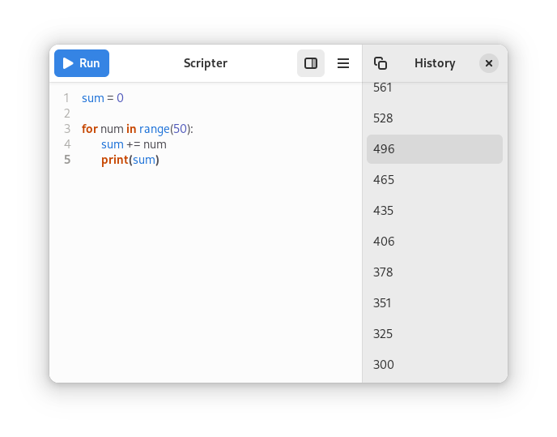

  
  <h1 align="center">Scripter</h1>

A very simple, native GNOME app for writing and executing simple Python scripts.
It can be used as an advanced calculator or as an editor for testing simple scripts in Python.

## Table of Contents

- [Installation](#Installation)
- [Usage](#Usage)
- [Thanks](#Thanks)

## Installation

1. Follow the installation instructions [here](https://github.com/AparokshaUI/AdwaitaTemplate#install-the-swift-freedesktop-sdk-extension).
2. Download this repository's source code and open the folder using [GNOME Builder](https://apps.gnome.org/Builder/).
3. Next to the hammer icon, in the dropdown menu, select `Export` and wait for the file browser to appear.
4. Open the `.flatpak` file with [GNOME Software](https://apps.gnome.org/Software/) and install the app.

## Usage

Write a simple Python script. Run using the `Run` button or `Ctrl+Return`.
Print results using the `print` function so that they appear in the app's UI.

Look up and copy previous outputs in the sidebar. Open it using the button in the toolbar.

## Thanks

### Dependencies
- [Adwaita](https://github.com/AparokshaUI/Adwaita) licensed under the [GPL-3.0 license](https://github.com/AparokshaUI/Adwaita/blob/main/LICENSE.md)
- [CodeEditor](https://github.com/AparokshaUI/CodeEditor) licensed under the [GPL-3.0 license](https://github.com/AparokshaUI/CodeEditor/blob/main/LICENSE.md)
